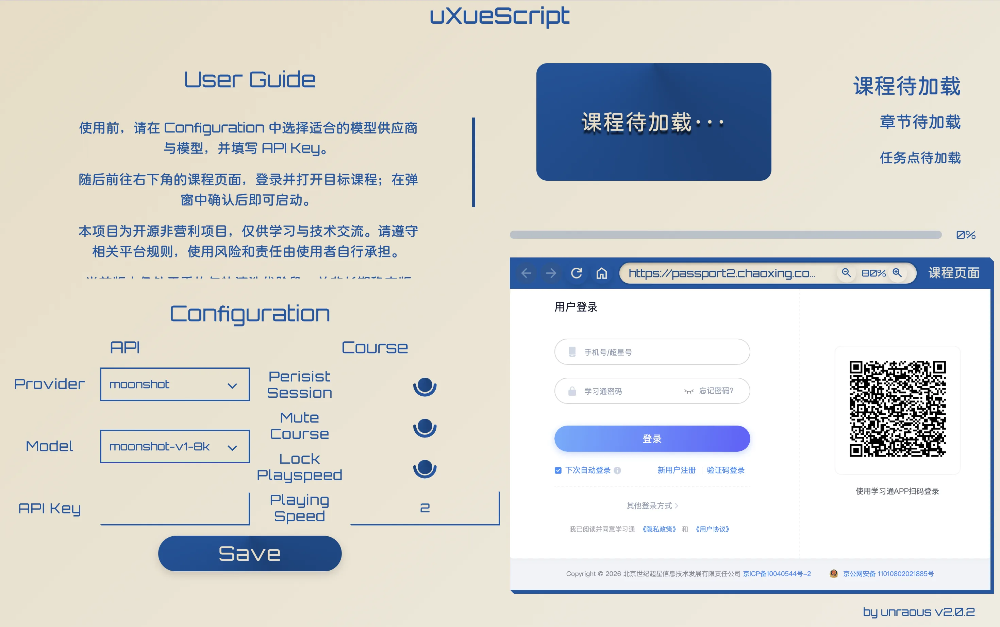

<h1 align="center">uXueScript 2.0</h1>

<p align="center">
  
</p>

<p align="center">
  <strong>轻量级学习通自动化桌面客户端</strong><br>
  课程任务自动处理 · 可选 AI 题目参考 · 独立浏览器脚本
</p>

<p align="center">
  <a href="https://github.com/unraous/uxuescript/releases/latest"></a>
  
  
  
  
  
  
</p>

<p align="center">
  <a href="https://github.com/unraous/uxuescript/releases/latest">下载最新版本</a> ·
  <a href="docs/usage/desktop.md">桌面端使用</a> ·
  <a href="docs/usage/ai.md">智能答题</a> ·
  <a href="docs/backend-free.md">无后端模式</a> ·
  <a href="docs/architecture/overview.md">架构概览</a> ·
  <a href="https://github.com/unraous/uxuescript/issues">反馈问题</a>
</p>

---

uXueScript 是面向学习通网页版课程的轻量级自动化辅助客户端。桌面端以内嵌原生 WebView 运行课程页面，在识别到相应页面后自动注入自动化核心脚本，并在现代化仪表盘中实时同步课程、章节与任务点进度；同时内置混淆字体逆向与 AI 辅助答题能力，为章节测验提供高精度的参考答案。

本项目使用 **Rust + Tauri 2 + Vue 3** 从旧版 [uXuexitongJS](https://github.com/unraous/uxuescript/tree/history) 重构而来，并严格保留了可直接复制到浏览器控制台执行的自包含单文件脚本，提供无后端的轻量级体验。

> 当前版本为 `v2.0.2`，处于持续演进与完善阶段。遇到问题前，建议先更新至最新 Release，并查阅[常见问题解答](docs/troubleshooting.md)。

## 运行预览

<p align="center">
  
</p>

## 核心特性

- **轻量原生架构：** 基于 Tauri 2 + Webview2/WebKit，Windows 发行包仅约 `6–7 MB`，完全摆脱 Python、Selenium 与 WebDriver 运行时依赖。
- **全自动化课程流转：**
  - 自动识别课程目录树与完成状态，智能跳过已完成小节，自动推进未完成任务。
  - 支持视频播放、倍速锁定、自动静音与后台防暂停挂机。
  - 支持 PDF 与图文文档的自动平滑滚动触底与完成状态判定。
- **加密字体逆向与 AI 测验求解：**
  - 内置 TrueType 轮廓解析引擎，逆向破解超星 `font-cxsecret` 动态混淆字体，还原题目真实明文。
  - 支持调用主流大语言模型，覆盖单选、多选、判断、填空与富文本简答等题型，并自动回填提交。
- **后台常驻与失焦状态守护：**
  - 拦截窗口失焦（`blur`）、多任务切屏（`visibilitychange`）、鼠标移出等打断暂停事件，保持页面聚焦活跃态，确保后台运行不被中断。
- **双模式自由切换：** 兼顾“开箱即用桌面端”与“无后端浏览器控制台脚本”。

## 双运行模式对比

| 功能特性 | 桌面客户端模式 (Tauri + Vue) | 独立脚本模式 (`core.js`) |
| :--- | :---: | :---: |
| **执行环境** | 内嵌桌面 WebView | 任意现代浏览器控制台 (Console) |
| **环境依赖** | 无需额外运行时 (解压即用) | 需自行登录并手动注入脚本 |
| **视频自动播放 / 静音 / 倍速** | 支持 (本地配置记忆与锁定) | 支持 (默认 2.0x 倍速与静音) |
| **PDF / 文档阅读自动滚动** | 支持 | 支持 |
| **后台运行 / 失焦防暂停守护** | 支持 | 支持 |
| **课程章节自动连续流转** | 支持 | 支持 |
| **课程元数据与仪表盘监控** | 支持 (实时章节图表与进度展示) | 仅浏览器控制台日志输出 |
| **`font-cxsecret` 混淆字体还原** | 支持 (内置 TrueType 矢量逆向解析) | 需后端配合 (独立模式不支持) |
| **大模型测验自动求解与回填** | 支持 (多 Provider / 多题型适配) | 需后端配合 (独立模式不支持) |
| **登录状态与会话保持** | 支持 (本地存储持久化) | 取决于当前浏览器 Cookies |

> 独立脚本详细执行指引见[无后端模式文档](docs/backend-free.md)。

## 系统架构与工作流

系统遵循严格的分层解耦架构与渐进增强契约，整体由 **前端展示层 (Vue 3)**、**Tauri 2 / Rust 宿主核心**、**内嵌自动化沙箱 (`core.js`)** 与 **外部服务生态** 协同构成：

```mermaid
flowchart TB
    %% 外部服务与模型生态
    subgraph External["外部服务与模型生态"]
        CXServer["超星学习通服务器<br/>(mooc1 / mooc2 / passport2)"]
        LLMCloud["各大 LLM 供应商 API<br/>(DeepSeek / OpenAI / Gemini / 智谱 等)"]
        OllamaLocal["本地 Ollama 服务<br/>(http://localhost:11434)"]
    end

    %% 前端展示与交互层
    subgraph Frontend["前端展示与交互层 (Vue 3 + TS)"]
        MainView["主控制面板 (TheMainPage.vue)<br/>- 课程看板、控制栏与配置面板"]
        MaskView["动画遮罩层 (TheMaskPage.vue)<br/>- 启动开场动画与淡出退出"]
        SpectaClient["类型安全 IPC 客户端 (cmds.ts)"]
    end

    %% Rust / Tauri 2 宿主与调度核心
    subgraph Backend["Rust / Tauri 2 宿主与调度核心"]
        MacroHandler["编译期命令分发器 (commands_collector)"]
        WindowEngine["窗口几何管理 (app::window / webview)<br/>- 齐次比例自适应布局与历史栈"]
        RouteEngine["页面分类与脚本调度 (core::url / script)<br/>- 页面特征识别与动态 eval 注入"]
        ConfigStore["纯 DTO 配置管理 (config)<br/>- API Key 脱敏与运行参数持久化"]
        FontParser["字体逆向引擎 (typr.rs 与 mapper.rs)<br/>- TTF 轮廓解析与码表哈希还原"]
        LLMDispatcher["LLM 并发分发器 (dispatcher.rs)<br/>- 题目切片、信号量限流与 429 重试"]
    end

    %% 内嵌课程运行环境
    subgraph WebviewContext["内嵌课程运行环境 (Webview: 'chaoxing')"]
        CoreEngine["core.js 自动化引擎 (自包含单文件)"]
        StateGuard["后台运行与失焦守护<br/>- 拦截失焦打断并保持聚焦活跃态"]
        DOMWalker["DOM 穿透探测器<br/>- 章节树遍历与多层嵌套 iframe 穿透"]
        TaskPipeline["任务执行步进器<br/>- 视频倍速锁定、PDF 滚动与富文本答题"]
        CourseDOM["超星课程页面 DOM"]
    end

    %% 通信与数据流向
    MainView --> SpectaClient
    SpectaClient <-->|Tauri IPC| MacroHandler
    MaskView <-->|窗口事件通知| MacroHandler

    MacroHandler --> WindowEngine
    MacroHandler --> RouteEngine
    MacroHandler --> ConfigStore
    MacroHandler --> FontParser
    MacroHandler --> LLMDispatcher

    WindowEngine -.->|齐次比例几何贴合与缩放| CourseDOM
    RouteEngine ==>|页面加载完成后动态注入| CoreEngine

    CoreEngine --> StateGuard
    CoreEngine --> DOMWalker
    DOMWalker --> TaskPipeline
    TaskPipeline <-->|交互操作与完成监听| CourseDOM

    TaskPipeline -->|1. 提取加密 HTML 题目 (solve_quiz)| MacroHandler
    MacroHandler -->|调用解析| FontParser
    FontParser -->|还原明文题目| LLMDispatcher
    LLMDispatcher <==>|HTTP POST 推理请求| LLMCloud
    LLMDispatcher <==>|本地 HTTP API| OllamaLocal
    LLMDispatcher -->|2. 返回结构化答案| TaskPipeline

    TaskPipeline -.->|3. 提交任务进度 (send_status)| MacroHandler
    MacroHandler -.->|status-update 事件广播| MainView

    CourseDOM <==>|加载课程与音视频资源| CXServer
```

### 核心数据与控制管线：
1. **页面识别与脚本注入管线**：课程 WebView 发生导航时，[`core::url`](file:///Users/plochirm/Workspace/uxuescript/src-tauri/src/core/url.rs) 对 URL 特征进行精确分类；页面 `PageLoad::Finished` 后，由 [`core::script`](file:///Users/plochirm/Workspace/uxuescript/src-tauri/src/core/script.rs) 将单文件自包含的 [`core.js`](file:///Users/plochirm/Workspace/uxuescript/src-tauri/src/scripts/core.js) 动态注入至页面主框架。
2. **混淆字体逆向与解密管线**：章节测验触发时，前端抓取页面 DOM 传至后端的 [`solve_quiz`](file:///Users/plochirm/Workspace/uxuescript/src-tauri/src/commands/chaoxing.rs)；[`typr.rs`](file:///Users/plochirm/Workspace/uxuescript/src-tauri/src/core/quiz/typr.rs) 解析 TTF 的 `loca` 与 `glyf` 表提取二次贝塞尔曲线轮廓，比对哈希特征字典 [`table.json`](file:///Users/plochirm/Workspace/uxuescript/src-tauri/src/core/quiz/table.json) 将加密文字无损还原为明文。
3. **高并发与弹性 LLM 分发管线**：明文题目进入 [`dispatcher.rs`](file:///Users/plochirm/Workspace/uxuescript/src-tauri/src/core/quiz/llm/dispatcher.rs) 后以 5 题为一组进行 Chunk 切片，通过 `tokio::sync::Semaphore` 进行 10 路并发控制；遇到 HTTP 429 速率限制时自动解析 `Retry-After` 头并启动指数退避重试。
4. **双向进度感知与状态广播管线**：自动化脚本中的 [`MutationObserver`](file:///Users/plochirm/Workspace/uxuescript/src-tauri/src/scripts/core.js) 确认任务点完成（`ans-job-finished`）后，通过 [`send_status`](file:///Users/plochirm/Workspace/uxuescript/src-tauri/src/commands/chaoxing.rs) 发送状态增量，后端向主窗口广播 `status-update` 事件，驱动 Vue 仪表盘与进度条实时响应。

详细架构设计分析见[架构概览文档](docs/architecture/overview.md)。

## 支持的 AI 模型供应商

在桌面客户端中，点击左侧 **Configuration** 即可配置并一键切换以下主流模型供应商：

| 供应商 (Provider) | 默认接入协议 | 支持特性 |
| :--- | :--- | :--- |
| **DeepSeek** | OpenAI Chat Completions | 官方与第三方 API 接入，支持深度思考与高速推理 |
| **OpenAI** | OpenAI Chat Completions / Responses | GPT-4o, GPT-4o-mini 等全系列模型 |
| **Google Gemini** | Google Gemini Native API | Gemini 1.5 Pro, Flash 等系列 |
| **Moonshot (Kimi)** | OpenAI Chat Completions | 长文本理解与大容量题干上下文 |
| **智谱 BigModel** | OpenAI Chat Completions | GLM 系列模型 |
| **OpenRouter** | OpenAI Chat Completions | 汇聚全球数十种开源与商业模型 |
| **本地 Ollama** | 本地 HTTP API | 纯本地离线运行，客户端支持一键拉取本地已装模型列表 |

> 完整配置与 API Key 安全保存说明详见[智能答题指南](docs/usage/ai.md)。

## 快速开始

### 方式一：直接运行发行包 (推荐)

1. 前往 [Releases 页面](https://github.com/unraous/uxuescript/releases/latest) 下载对应系统的发行压缩包并解压。
2. 双击启动 `uxuescript`。
3. 在右下方内嵌 WebView 中登录学习通，进入目标课程与待学章节。
4. 页面识别加载后，点击课程页弹出的确认提示即可启动自动化任务。
5. *(可选)* 若需启用智能答题，先在左侧 **Configuration** 中配置 **Provider**、**Model** 与 **API Key** 并点击 **Save**。

详细操作与图文流程参见[桌面端使用指南](docs/usage/desktop.md)。

### 方式二：从源码构建

开发与构建前请确保本机已配置以下环境：
- [Node.js](https://nodejs.org/) (>= 18) 与 [pnpm](https://pnpm.io/)
- [Rust](https://www.rust-lang.org/) (>= 1.97) 与 Cargo
- 操作系统对应的 [Tauri 2 构建前置依赖](https://v2.tauri.app/start/prerequisites/)

```bash
# 1. 克隆代码仓库
git clone https://github.com/unraous/uxuescript.git
cd uxuescript

# 2. 安装前端依赖
pnpm install --frozen-lockfile

# 3. 启动桌面端热重载开发环境
pnpm tauri dev

# 4. 构建生产发行包
pnpm tauri build
```

生产打包细节与各平台要求参见[构建指南](docs/development/build.md)。

## 当前状态与使用边界

- **跨平台适配：** 目前主发布与验证平台为 Windows（x64）；macOS 与 Linux 平台的打包流水线、应用图标与权限适配正处于持续完善中。
- **免责与合规声明：** 本项目仅供个人学习、软件工程研究与自动化技术交流，作者与贡献者不对使用本软件造成的任何后果承担责任。请严格遵守所在高校与超星平台的规章制度，严禁用于任何形式的考试作弊或商业用途。
- **智能答题局限：** 模型生成的答题结果受限于模型自身的推理精度与题库分布，仅供参考辅助，无法保证 100% 正确率。
- **凭据与安全性：** API Key 仅保存在本地客户端配置文件中，绝不上传任何第三方云端。请妥善保管个人密钥，勿提交至公开仓库。

## 文档导航

- [桌面端使用指南](docs/usage/desktop.md)：客户端各项功能、模型配置、课程选项与状态看板。
- [智能答题指南](docs/usage/ai.md)：AI 模型配置、题目提取处理与混淆字体还原技术说明。
- [无后端模式说明](docs/backend-free.md)：如何在任意浏览器的开发者控制台直接执行单文件脚本。
- [架构概览与技术内幕](docs/architecture/overview.md)：前后端通信、WebView 编排与自动化执行链路。
- [常见问题与故障排查](docs/troubleshooting.md)：粘贴限制、网络连接、模型速率限制与常见异常排查。
- [开发与构建指南](docs/development/build.md)：本地开发环境搭建、单元测试运行与各平台分发包构建。

## 反馈与贡献

欢迎提交 Issue 与 Pull Request 共同改进项目：
- 遇到 Bug 或页面不兼容，请在 [GitHub Issues](https://github.com/unraous/uxuescript/issues) 提交包含复现步骤、课程类型与控制台报错日志的反馈。
- 也可以通过邮件与作者联系：<unraous@qq.com>。

## 开源许可证

本项目除特定第三方资源外，核心源代码依据 [GNU GPL v3.0](LICENSE) 许可证开源发布。  
第三方字体、字形特征哈希表与依赖库的版权与开源声明请参阅 [THIRD_PARTY_NOTICES.md](THIRD_PARTY_NOTICES.md)。
